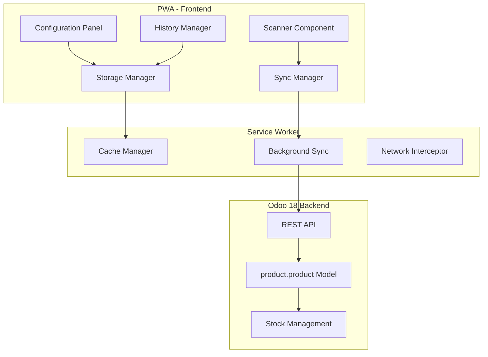
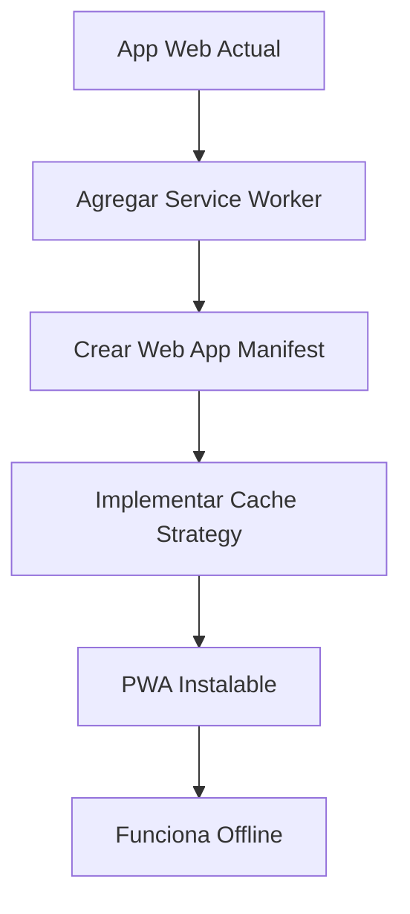
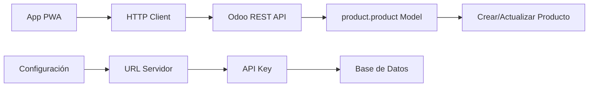
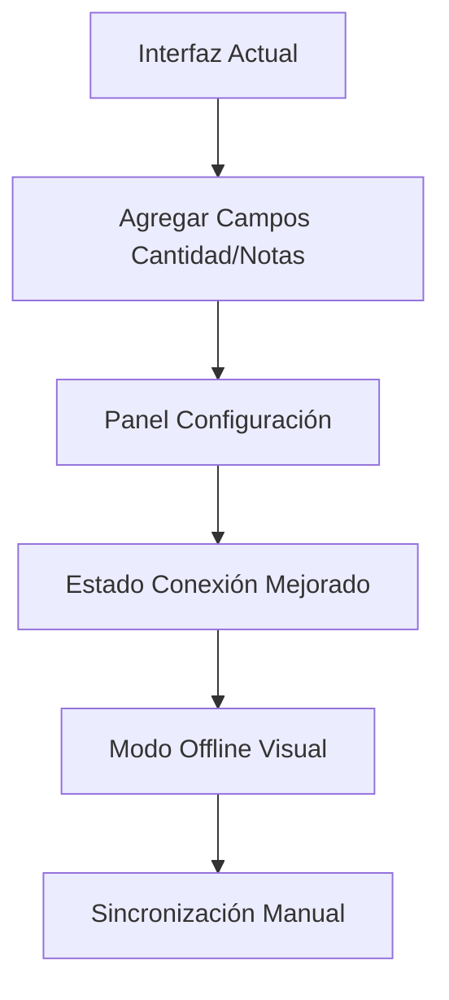
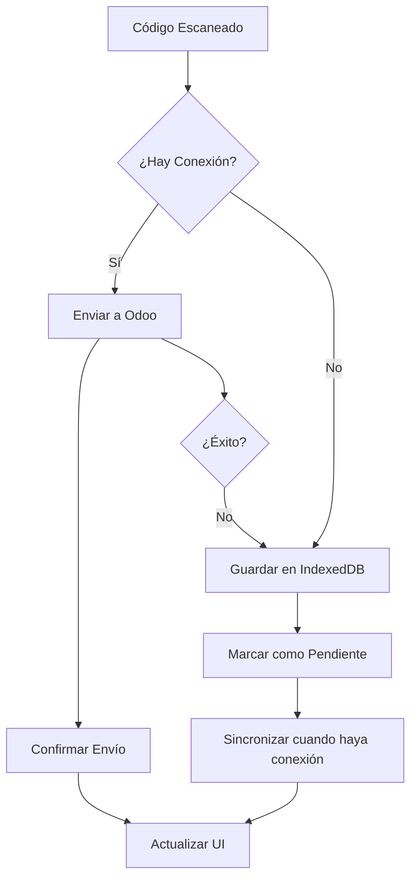

# Plan de Mejoras - Escáner de Códigos de Barras PWA

## **RESUMEN EJECUTIVO**

Transformación de la aplicación web actual de escaneo de códigos de barras en una **Progressive Web App (PWA)** instalable en Android, con integración HTTP a Odoo 18 ERP y capacidades offline/online híbridas.

## **ANÁLISIS DEL CÓDIGO ACTUAL**

### **Fortalezas Identificadas**
- ✅ Escáner de códigos de barras funcional (Quagga.js)
- ✅ Interfaz responsive con Tailwind CSS
- ✅ Historial de códigos escaneados
- ✅ Sistema de notificaciones toast
- ✅ Exportación a CSV/EXEL/JSON
- ✅ Arquitectura JavaScript modular

### **Limitaciones Identificadas**
- ❌ No es instalable en móviles (falta PWA)
- ❌ Usa Bluetooth en lugar de HTTP para comunicación
- ❌ No tiene configuración para ERP
- ❌ No maneja datos offline
- ❌ No tiene campos para cantidad y notas
- ❌ No está optimizada para el formato de datos de Odoo

## **OBJETIVOS DEL PROYECTO**

1. **📱 Instalabilidad**: Convertir en PWA instalable en Android
2. **🌐 Conectividad HTTP**: Integración directa con Odoo 18 via API REST
3. **🔄 Modo Híbrido**: Funcionamiento offline con sincronización automática
4. **📊 Datos Completos**: Captura de cantidad, notas y metadatos
5. **⚙️ Configuración Simple**: Panel de configuración para conexión ERP

## **ARQUITECTURA PROPUESTA**



## **FASES DE DESARROLLO**

### **Fase 1: Conversión a PWA**



**Componentes a desarrollar:**

1. **Web App Manifest** (`manifest.json`)
   ```json
   {
     "name": "Escáner de Códigos de Barras",
     "short_name": "BarcodeScan",
     "description": "Escáner de códigos de barras con integración ERP",
     "start_url": "/",
     "display": "standalone",
     "background_color": "#ffffff",
     "theme_color": "#3B82F6",
     "icons": [
       {
         "src": "assets/icons/icon-192.png",
         "sizes": "192x192",
         "type": "image/png"
       },
       {
         "src": "assets/icons/icon-512.png",
         "sizes": "512x512",
         "type": "image/png"
       }
     ]
   }
   ```

2. **Service Worker** (`sw.js`)
   - Cache de recursos estáticos
   - Cache de datos dinámicos
   - Background sync para datos pendientes
   - Estrategia cache-first para recursos
   - Network-first para datos de API

3. **Install Prompt** personalizado
   - Detección de instalabilidad
   - Banner de instalación personalizado
   - Guía de instalación paso a paso

### **Fase 2: Integración con Odoo 18**



**Componentes de integración:**

1. **Cliente HTTP para Odoo** (`odoo-client.js`)
   ```javascript
   class OdooClient {
     constructor(config) {
       this.baseUrl = config.baseUrl;
       this.apiKey = config.apiKey;
       this.database = config.database;
     }
     
     async scanProduct(barcodeData) {
       const payload = {
         jsonrpc: "2.0",
         method: "call",
         params: {
           service: "object",
           method: "execute_kw",
           args: [
             this.database,
             this.userId,
             this.password,
             "product.product",
             "create_or_update_by_barcode",
             [barcodeData]
           ]
         }
       };
       
       return await this.makeRequest('/jsonrpc', payload);
     }
   }
   ```

2. **Estructura de datos para Odoo:**
   ```json
   {
     "barcode": "1234567890123",
     "timestamp": "2025-01-07T14:30:00Z",
     "quantity": 1,
     "notes": "Escaneado desde móvil",
     "device_info": {
       "user_agent": "Mozilla/5.0...",
       "app_version": "1.0.0",
       "device_type": "mobile"
     }
   }
   ```

3. **Configuración de autenticación:**
   - API Key en header: `Authorization: Bearer {API_KEY}`
   - Base de datos en header: `X-Database: {DATABASE_NAME}`
   - Content-Type: `application/json`

### **Fase 3: Mejoras de UI/UX**



**Nuevas funcionalidades de interfaz:**

1. **Panel de Configuración**
   - URL del servidor Odoo
   - API Key (campo password)
   - Nombre de base de datos
   - Configuración de sincronización
   - Test de conexión

2. **Campos adicionales en escaneo:**
   - Cantidad (input numérico con +/- buttons)
   - Notas opcionales (textarea expandible)
   - Validación en tiempo real

3. **Indicadores de estado mejorados:**
   - Estado de conexión a internet (online/offline)
   - Estado de sincronización con Odoo
   - Contador de elementos pendientes de sincronizar
   - Progreso de sincronización en tiempo real

4. **Modo offline visual:**
   - Banner indicando modo offline
   - Lista de elementos pendientes
   - Botón de sincronización manual
   - Estimación de tiempo de sincronización

### **Fase 4: Gestión Offline/Online Híbrida**



