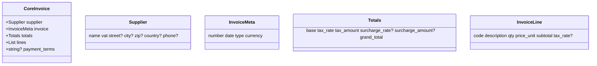

# PLAN OCR → MISTRAL → FASTAPI → ODOO 18 – Integración completa

> Última actualización: 30-06-2025

## 1. Objetivo global
Automatizar la entrada de facturas/albaranes en Odoo 18 a partir de documentos PDF/imagen procesados con Mistral OCR, creando o actualizando proveedores, productos, precios de compra y generando pedidos/facturas de compra, todo desde el backend FastAPI y consumido por el frontend React.

## 2. Hit-List de avances logrados hasta hoy
| Fecha | Hito |
|-------|------|
| 25-06 | Conexión robusta FastAPI ⇄ Odoo, CRUD proveedores y productos funcionando. |
| 26-06 | Endpoints paginados `/api/v1/providers` y correcciones frontend (spinner infinito). |
| 27-06 | OCR endpoint `/api/v1/mistral-ocr/process-document` operativo; router incluido. |
| 30-06 | • Prevención de duplicados de proveedor (check `vat` / nombre).<br>• Método `get_provider_by_id` implementado.<br>• ALMCE facturas OCR analizadas; identificados campos comunes.<br>• Estrategia **CoreInvoice + adapters** definida. |

## 3. Modelo de datos propuesto


## 4. Arquitectura por capas
1. **Mistral OCR** → devuelve JSON crudo por archivo.
2. **Adapter específico de proveedor** → mapea JSON crudo → `CoreInvoice`.
3. **InvoiceImportService** (FastAPI)
   1. Busca/crea proveedor en `res.partner` (dup-safe).
   2. Empareja o crea productos (`product_template/product_product`).
   3. Actualiza/crea precios (`product_supplierinfo`).
   4. Genera borrador `purchase.order` y, opcionalmente, `account.move`.
   5. Devuelve resultado y guarda JSON crudo para trazabilidad.
4. **UI React** → botón “Importar factura OCR”.

## 5. Análisis de proveedor piloto (ALMCE)
Campos fiables detectados:
- CIF proveedor: `B-14891592` (clave para `vat`).
- Nº factura y fecha en tabla cabecera.
- Líneas con tabla Markdown 5 columnas (`code, desc, qty, unit_price, subtotal`).
- Totales + IVA 21 % y RE 5.2 %.

Variaciones menores: uso de coma decimal, multi-página (“Suma y sigue”). Adapter ALMCE cubrirá estas casuísticas.

## 6. Próximos pasos
| Nº | Acción | Responsable | Prioridad |
|----|--------|-------------|-----------|
| 1 | Escribir `ALMCEAdapter` (regex/markdown parser) → `CoreInvoice`. | Backend | Alta |
| 2 | Implementar `CoreInvoice` Pydantic models. | Backend | Alta |
| 3 | Crear `InvoiceImportService` + endpoint `POST /invoices/import-ocr`. | Backend | Alta |
| 4 | Tests unitarios con 4 muestras ALMCE (factura, albarán, abono). | QA | Media |
| 5 | Frontend: componente de carga y vista de resultados. | Front | Media |
| 6 | Repetir para otros proveedores: añadir adapters JATA, BSH… | Backend | Media |
| 7 | Dashboard de estadísticas de compras (opcional). | Data | Baja |

## 7. Consideraciones técnicas y buenas prácticas
- **Duplicados**: clave `vat` primero, fallback búsqueda `name ilike`.
- **Borrado proveedor**: solo archivar (`active=False`) si existen dependencias.
- **Transacciones**: agrupar operaciones XML-RPC críticas.
- **Logs & auditoría**: guardar OCR crudo y registrar coincidencias/creaciones.
- **Seguridad**: endpoints protegidos con JWT; ficheros OCR no se almacenan en frontend.
- **Configuración**: URL Odoo mediante env `ODOO_URL` (`http://odoo:8069`).

## 8. Timeline sugerido
```
S1  S2  S3  S4
│──┼──┼──┼──┤ Junio–Julio 2025
│ALMCE adapter + servicio
   │ Tests + UI
        │ Otros proveedores
             │ Dashboard opcional
```

---
Fin del plan. Cualquier ajuste se documentará en este archivo.
