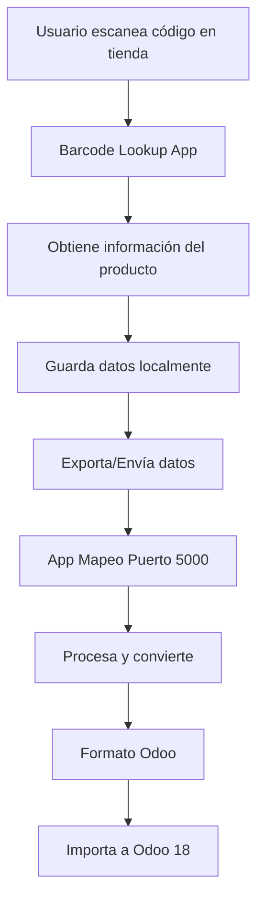

# Documentación de la Aplicación Web de Mapeo de Datos de Proveedores

## Descripción General

La aplicación web `app_mapeo.py` es una solución independiente desarrollada en Flask que se ejecuta en el puerto 5000. Su objetivo principal es facilitar la importación y conversión de datos de proveedores al formato compatible con Odoo 18.

## Características Principales

### 🎯 Funcionalidades Core
- **Subida de archivos**: Permite cargar archivos CSV, XLS y XLSX de proveedores
- **Detección automática de proveedores**: Identifica automáticamente el formato del proveedor (ALMCE, BSH, CECOTEC)
- **Análisis inteligente**: Procesa y analiza el contenido de los archivos
- **Conversión a formato Odoo**: Genera archivos CSV compatibles con Odoo 18
- **Interfaz web intuitiva**: Dashboard web responsive con Bootstrap 5
- **API REST**: Endpoints para integración programática

### 📁 Estructura de Directorios
```
/home/espasiko/mainmanusodoo/manusodoo-roto/
├── app_mapeo.py              # Aplicación principal Flask
├── templates/
│   ├── index.html            # Interfaz principal
│   └── analisis.html         # Página de análisis
├── static/
│   ├── uploads/              # Archivos subidos por usuarios
│   └── graficos/             # Gráficos generados
├── ejemplos/                 # Archivos de ejemplo
├── odoo_import/              # Archivos convertidos para Odoo
├── informes/                 # Informes generados
└── ia_mapeo.py              # Módulo de análisis IA
```

## Configuración Técnica

### 🔧 Especificaciones
- **Framework**: Flask (Python)
- **Puerto**: 5000
- **Host**: 0.0.0.0 (accesible desde cualquier IP)
- **Modo**: Debug activado
- **Límite de archivos**: 16 MB máximo
- **Formatos soportados**: CSV, XLS, XLSX

### 🌐 URLs de Acceso
- Local: `http://localhost:5000`
- Red local: `http://172.21.181.243:5000`
- Loopback: `http://127.0.0.1:5000`

## Endpoints Disponibles

### 📄 Rutas Web
| Ruta | Método | Descripción |
|------|--------|-------------|
| `/` | GET | Página principal con dashboard |
| `/upload` | POST | Subir archivo para análisis |
| `/analizar/<filename>` | GET | Analizar archivo específico |
| `/convertir/<filename>` | GET | Convertir archivo a formato Odoo |
| `/descargar/<filename>` | GET | Descargar archivo convertido |

### 🔌 API REST
| Endpoint | Método | Descripción |
|----------|--------|-------------|
| `/api/archivos` | GET | Listar todos los archivos disponibles |
| `/api/analizar/<filename>` | GET | Análisis detallado de archivo (JSON) |

## Flujo de Trabajo del Usuario

### 1. 📤 Subida de Archivo
1. El usuario accede a `http://localhost:5000`
2. Selecciona un archivo CSV/Excel desde su dispositivo
3. Hace clic en "Subir y Analizar"
4. El sistema guarda el archivo en `/static/uploads/`

### 2. 🔍 Análisis Automático
1. **Detección de proveedor**: El sistema identifica automáticamente el formato
2. **Procesamiento**: Aplica las reglas específicas del proveedor
3. **Enriquecimiento**: Añade categorías y atributos faltantes
4. **Validación**: Verifica la integridad de los datos

### 3. 📊 Visualización de Resultados
- **Estadísticas generales**: Total de productos, productos con código, etc.
- **Distribución de categorías**: Gráficos de categorías detectadas
- **Porcentajes de completitud**: Datos sobre campos completos/incompletos

### 4. 💾 Conversión y Descarga
1. **Generación**: Crea archivo CSV compatible con Odoo 18
2. **Almacenamiento**: Guarda en `/odoo_import/`
3. **Descarga**: Permite descargar el archivo convertido

## Proveedores Soportados

### 🏪 ALMCE
- Procesamiento específico para formato ALMCE
- Mapeo de campos personalizado
- Aplicación de márgenes específicos

### 🏪 BSH
- Adaptación para archivos BSH
- Conversión de códigos de producto
- Categorización automática

### 🏪 CECOTEC
- Formato específico CECOTEC
- Procesamiento de precios y márgenes
- Gestión de variantes de producto

## Integración con Códigos de Barras

### 📱 Evaluación de Barcode Lookup Mobile App

Basándose en la información de `https://www.barcodelookup.com/mobile-app`, esta aplicación móvil ofrece:

#### ✅ Características Gratuitas
- **Descarga gratuita** en Google Play y App Store
- **Escaneo ilimitado** de códigos de barras
- **Base de datos masiva**: 1,440,633,068 productos únicos
- **Múltiples formatos**: UPC, EAN, ISBN, JAN, ITF-14
- **Búsqueda por nombre** cuando no hay código de barras

#### 🔄 Flujo de Integración Propuesto



#### 📋 Proceso Detallado de Integración

1. **Escaneo en Tienda**
   - El usuario utiliza Barcode Lookup Mobile App
   - Escanea códigos UPC/EAN de productos físicos
   - La app obtiene: nombre, descripción, imágenes, precios

2. **Recopilación de Datos**
   - Los datos se almacenan en el historial de la app
   - Información incluye: código de barras, nombre, categoría, precios de referencia

3. **Exportación a Sistema**
   - **Opción A**: Exportar historial como CSV/Excel
   - **Opción B**: Integración API (requiere desarrollo)
   - **Opción C**: Entrada manual en app web puerto 5000

4. **Procesamiento en App Mapeo**
   - Recibe archivo con códigos de barras escaneados
   - Enriquece datos con información de proveedores
   - Aplica márgenes y precios específicos de la tienda
   - Asigna categorías según taxonomía de Odoo

5. **Conversión a Odoo**
   - Genera archivo CSV compatible con Odoo 18
   - Incluye campos: `default_code`, `name`, `categ_id`, `list_price`, `barcode`
   - Mantiene trazabilidad del código de barras original

6. **Importación Final**
   - Utiliza el importador `importador_productos_odoo.py`
   - Conecta con Odoo en puerto 8070
   - Crea/actualiza productos en el sistema

#### 🛠️ Implementación Técnica

**Modificaciones necesarias en `app_mapeo.py`:**

```python
# Nuevo endpoint para códigos de barras
@app.route('/api/barcode', methods=['POST'])
def procesar_codigo_barras():
    """
    Procesa códigos de barras escaneados
    Entrada: JSON con código de barras y datos del producto
    Salida: Producto enriquecido para Odoo
    """
    pass

# Función para enriquecer con datos de barcode lookup
def enriquecer_con_barcode_lookup(codigo_barras):
    """
    Enriquece producto con datos de Barcode Lookup API
    """
    pass
```

**Campos adicionales para Odoo:**
- `barcode`: Código de barras EAN/UPC
- `default_code`: Código interno del producto
- `name`: Nombre del producto
- `description`: Descripción detallada
- `categ_id`: Categoría asignada
- `list_price`: Precio de venta
- `standard_price`: Precio de coste

## Ventajas de la Integración

### 📈 Beneficios Operativos
- **Inventario automático**: Escaneo rápido de productos en tienda
- **Datos enriquecidos**: Información completa de productos
- **Reducción de errores**: Eliminación de entrada manual
- **Actualización en tiempo real**: Sincronización con Odoo

### 💰 Beneficios Económicos
- **Solución gratuita**: No hay costes de licencias
- **Ahorro de tiempo**: Automatización del proceso
- **Mejor gestión de stock**: Control preciso de inventario
- **Precios competitivos**: Comparación automática de precios

## Instalación y Uso

### 🚀 Inicio Rápido

```bash
# Navegar al directorio del proyecto
cd /home/espasiko/mainmanusodoo/manusodoo-roto

# Activar entorno virtual
source venv/bin/activate

# Instalar dependencias
pip install -r requirements.txt

# Ejecutar aplicación
python3 app_mapeo.py
```

### 🌐 Acceso Web
1. Abrir navegador
2. Ir a `http://localhost:5000`
3. Subir archivo de proveedor
4. Analizar y convertir
5. Descargar archivo para Odoo

## Mantenimiento y Soporte

### 📝 Logs y Debugging
- **Modo debug**: Activado por defecto
- **Logs en consola**: Errores y trazas detalladas
- **Flash messages**: Notificaciones en interfaz web

### 🔧 Configuración Avanzada
- **Límite de archivos**: Modificar `MAX_CONTENT_LENGTH`
- **Formatos soportados**: Editar `ALLOWED_EXTENSIONS`
- **Directorios**: Personalizar rutas en variables `DIR_*`

### 🔄 Actualizaciones
- **Nuevos proveedores**: Añadir en `convertidor_proveedores.py`
- **Campos Odoo**: Modificar en `generar_product_template()`
- **Interfaz**: Actualizar templates HTML

## Conclusión

La aplicación web del puerto 5000 proporciona una solución completa y escalable para la gestión de datos de proveedores. Su integración con códigos de barras mediante Barcode Lookup Mobile App ofrece una oportunidad única para automatizar completamente el proceso de inventario y gestión de productos en Odoo 18.

**Estado actual**: ✅ Funcionando y operativo
**Próximos pasos**: Implementar integración con códigos de barras
**Mantenimiento**: Mínimo, aplicación estable y robusta